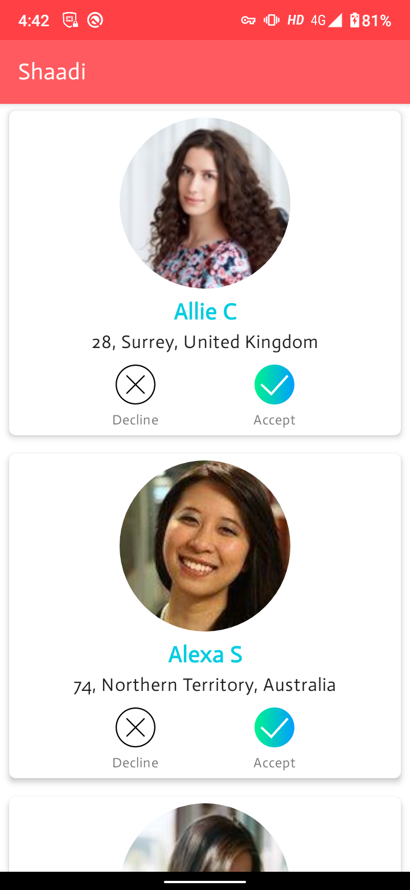
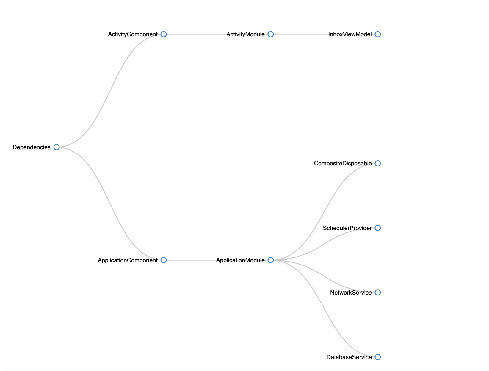

# Shaadi

## Libraries and tools 🛠

- [Kotlin](https://kotlinlang.org/)
- Architecture components
- [Dagger 2](https://developer.android.com/training/dependency-injection) for dependency injection 🗡
- [Retrofit](https://square.github.io/retrofit/)
- [RxJava2](https://github.com/ReactiveX/RxJava)
- [Room](https://developer.android.com/training/data-storage/room)
- [DataBinding](https://developer.android.com/topic/libraries/data-binding)
- [Mockito | Testing](https://developer.android.com/training/testing/unit-testing/local-unit-tests)

## Architecture

The app uses MVVM [Model-View-ViewModel] architecture to have a unidirectional flow of data, separation of concern, and testability.

## Dependency Graph 🔪

The following diagram shows the dependency graph of the app.

Generated by [Daggraph](https://github.com/dvdciri/daggraph)
